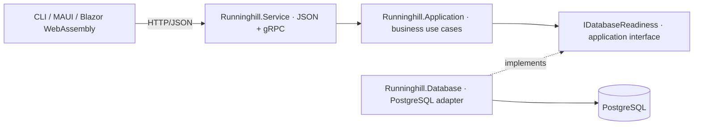

# Runninghill

A .NET 10 modular application with a central HTTP/JSON and gRPC service,
PostgreSQL persistence, CLI, Blazor WebAssembly, and MAUI clients.
The original assessment is preserved below. Word/sentence use cases are not yet implemented.

## Architecture



| Project | Responsibility |
| --- | --- |
| `Runninghill.Application` | Business rules/use cases and persistence interfaces. No database-provider or transport dependencies. |
| `Runninghill.Database` | PostgreSQL adapter using one pooled `NpgsqlDataSource` per host. References Application, not vice versa. |
| `Runninghill.Contracts` | Public transport DTOs and generated JSON metadata. Database entities and UI state stay separate. |
| `Runninghill.Service` | Dependency composition, authentication, authorization, transports, health checks, deadlines, concurrency limits, and telemetry. Calls Application directly. |
| `Runninghill.Cli` | Native command-line client. |
| `Runninghill.Web` | Browser-side Blazor WebAssembly client, AOT compiled on Release publish. No per-user server circuits. |
| `Runninghill.Maui` | Shared Windows/macOS/Android/iOS UI; connects to the service over HTTPS. |
| `Runninghill.Tests` | Managed test tooling for use cases, HTTP/gRPC, authorization, and health semantics. |

Clients reference Contracts and call the service directly with `HttpClient`, using
per-request bearer tokens and generated JSON metadata for AOT compatibility.
Business logic and database access remain in the service. All clients share
server-owned data. The browser uses
same-origin `/api` requests proxied by nginx; bearer tokens remain in page memory.
MAUI holds an entered token only in memory and reuses its HTTP client until the service
address changes. Neither client embeds a signing key or database credential.

`GET /api/status` returns `{ "message": "Runninghill is ready. Database schema verified." }`.
gRPC exposes `runninghill.v1.Application/GetStatus` using the existing protobuf
`Empty` and `StringValue` messages. Both require a JWT with the `status.read` scope.
The included clients use HTTP/JSON; other consumers can generate gRPC clients from
`src/Runninghill.Service/Protos/application.proto`.

## Three-container stack on Windows, macOS, or Linux

Docker Engine/Compose or Docker Desktop with **Linux containers** is required.
The three containers are the native service, nginx serving the AOT web application,
and PostgreSQL. The host-specific overrides select the CPU architecture; they are
not three different operating-system container images. macOS Docker containers run
in a Linux VM; Windows Docker Desktop must be in Linux-container mode.

```bash
python3 scripts/dev-setup.py

# Linux x64
docker compose -f compose.yaml -f deploy/compose.linux.yaml up --build -d

# macOS Apple Silicon
docker compose -f compose.yaml -f deploy/compose.macos.yaml up --build -d

# Windows x64 (PowerShell; use python instead of python3 if needed)
docker compose -f compose.yaml -f deploy/compose.windows.yaml up --build -d
```

Run only the command for your host. On Intel Macs set `DOCKER_PLATFORM=linux/amd64`;
on ARM Linux/Windows set `DOCKER_PLATFORM=linux/arm64`. Native AOT builds must use a
matching container architecture; emulation can make publishing substantially slower.

The setup script creates an ignored `.env` with random development credentials and
refuses to overwrite an existing file. Do not print `docker compose config` with real
secrets; use `docker compose config --quiet` to validate it.

Open `http://localhost:5082`. Generate a short-lived development token and paste it
into the web UI:

```bash
python3 scripts/dev-token.py
python3 scripts/smoke-stack.py
```

Ports: HTTP/JSON `5080`, gRPC HTTP/2 `5081`, web `5082`. Published ports bind only to
host loopback. PostgreSQL has no published port. HTTP inside this local development
stack is intentional; production and MAUI require an HTTPS endpoint with a trusted
certificate. No certificate-validation bypass is included.

```bash
docker compose ps
docker compose logs --tail 100 service
docker compose down
```

`down` preserves the named database volume. Do not use `down -v` unless you intend
to delete the database. The initialization SQL only runs for a new, empty volume.
Database schema changes must be applied separately as versioned migrations, not
concurrently by every service instance.

On this Linux machine Docker bridge creation fails with `operation not supported`.
The container images were built with `docker --context default build --network=host`;
the local stack can be run with the optional host-network override below. This binds
only loopback listeners and uses PostgreSQL port 55432. It is not the portable default:

```bash
docker --context default build --network=host -f Dockerfile.service -t runninghill-service .
docker --context default build --network=host -f Dockerfile.web -t runninghill-web .
docker --context default build -f Dockerfile.database -t runninghill-database .
docker --context default compose -f compose.yaml -f deploy/compose.host-network.yaml up -d --no-build
```

## Build, test, and run the CLI

Install a .NET 10 SDK. On this Linux installation, append
`-p:AllowMissingPrunePackageData=true` if its incomplete ASP.NET targeting pack
reports `NETSDK1226`.

```bash
dotnet build Runninghill.Server.slnf -m:1
dotnet test Runninghill.Server.slnf --no-build -m:1

# Linux: clang and zlib development headers are required for Native AOT.
dotnet publish src/Clients/Runninghill.Cli -c Release -r linux-x64 -o artifacts/cli/linux-x64
export RUNNINGHILL_SERVICE_URL=http://localhost:5080/
export RUNNINGHILL_ACCESS_TOKEN="$(python3 scripts/dev-token.py)"
./artifacts/cli/linux-x64/Runninghill.Cli status
```

For Windows use `-r win-x64` on a Windows host with Visual C++ build tools. For macOS
use `-r osx-arm64` or `osx-x64` on a Mac with Xcode command-line tools. Native AOT does
not cross-compile between operating systems.

To run the service without Docker, configure `ConnectionStrings__Runninghill`,
`Authentication__Audience`, and `Authentication__Authority` (HTTPS OIDC issuer).
Development can instead use `ASPNETCORE_ENVIRONMENT=Development` and
`Authentication__DevelopmentSigningKey` of at least 32 bytes. Production refuses
that fallback and requires an authority. The dev token issuer is
`runninghill-development`, with audience `runninghill`, scope `status.read`, and
15-minute expiry. Real login/token acquisition is provided by your identity provider;
the sample UI's token entry is not a complete login experience.

Run the web UI through its nginx container to get the same-origin API proxy. A bare
`dotnet run --project src/Clients/Runninghill.Web` serves static development assets but
does not provide that proxy.

## AOT support and its limits

AOT is a publish step. A successful Debug build is not proof of native compilation.
Libraries are marked `IsAotCompatible` and compile into their consuming app. Generated
JSON metadata avoids reflection-based serialization. `TrimmerRoots.xml` preserves
Blazor page types discovered by the router. Trimming warnings fail publish.

| Target | Release publishing strategy | No-JIT native executable? |
| --- | --- | --- |
| Service and CLI | `PublishAot=true` | Yes, on each supported native build host. |
| Web | `RunAOTCompilation=true`, Blazor WebAssembly | C# compiled to WebAssembly; browser runtime/glue remains. |
| MAUI iOS / Mac Catalyst | `PublishAot=true` | Yes; publish on a Mac with Xcode and appropriate signing. |
| MAUI Android | Mono AOT, profiling disabled, interpreter disabled | Uses Mono; do not equate this with Native AOT. |
| MAUI Windows | ReadyToRun | **No.** Precompiled code with possible JIT fallback. |
| Shared libraries | `IsAotCompatible=true` | Compiled as part of the published host. |
| xUnit test project | Managed test runner | Not a distributed product; not Native AOT published. |

It is not possible to honestly claim universal no-JIT Native AOT for this .NET 10
MAUI solution. The Windows target uses its supported ReadyToRun mode. Android uses
the supported Mono AOT runtime. Moving every target to strict Native AOT would require
changing the UI framework or selecting a future supported platform version.
See [MAUI compilation modes](https://learn.microsoft.com/dotnet/maui/deployment/runtimes-compilation?view=net-maui-10.0),
[MAUI Native AOT](https://learn.microsoft.com/dotnet/maui/deployment/nativeaot?view=net-maui-10.0), and
[ASP.NET AOT support](https://learn.microsoft.com/aspnet/core/fundamentals/native-aot?view=aspnetcore-10.0).

```bash
# Service: same OS-specific RID selection as the CLI.
dotnet publish src/Runninghill.Service -c Release -r linux-x64 -o artifacts/service/linux-x64

# Browser AOT (the web Dockerfile installs this workload too).
dotnet workload install wasm-tools
dotnet publish src/Clients/Runninghill.Web -c Release -o artifacts/web

# Android: native SDK/JDK and maui-android workload required.
dotnet publish src/Clients/Runninghill.Maui -c Release -f net10.0-android -r android-arm64

# This workspace has Android 36.1 and JDK 17:
dotnet publish src/Clients/Runninghill.Maui -c Release -f net10.0-android36.1 -r android-arm64 \
  -p:MauiTargetFrameworks=net10.0-android36.1 \
  -p:AndroidSdkDirectory="$HOME/Android/Sdk" -p:JavaSdkDirectory=/usr/lib/jvm/java-17-openjdk

# Windows: supported ReadyToRun, not Native AOT.
dotnet publish src/Clients/Runninghill.Maui -c Release -f net10.0-windows10.0.19041.0 -r win-x64

# Mac: native publish; configure signing for physical iOS devices.
dotnet publish src/Clients/Runninghill.Maui -c Release -f net10.0-maccatalyst -r maccatalyst-arm64
dotnet publish src/Clients/Runninghill.Maui -c Release -f net10.0-ios -r ios-arm64
```

CI publishes the service and CLI on Linux, Windows, and macOS, and builds/smoke-tests
the three-container Linux stack, including a real browser authentication check. Native UI signing and device tests remain platform-specific.

## Service operation

- `/health/live` checks only process responsiveness; database outages do not make it fail.
- `/health/ready` verifies the `runninghill.schema_info` marker is version 1. Missing
  tables or an unreachable database return 503. Missing connection configuration
  fails startup; there is no SQLite/in-memory fallback.
- The application itself also fails unavailable when schema readiness fails. This
  is the sample operation, not a recommendation to query health before every future use case.
- HTTP and gRPC calls are bounded to 10 seconds; database checks have a five-second
  command timeout. Each instance allows 64 concurrent API requests with no waiting queue.
- Authentication validates JWT issuer, audience, expiry, and signature; both transports
  enforce `status.read`. Anonymous health endpoints contain no connection details.
- Connection pooling is shared, request state is local to the request, and no automatic
  retries can duplicate future writes. Design idempotency before enabling write retries.
- Shutdown allows 30 seconds to drain work. Docker grants 35 seconds before forced termination.
- JSON logs and OpenTelemetry ASP.NET/Kestrel/PostgreSQL metrics and traces are configured.
  Set `OTEL_EXPORTER_OTLP_ENDPOINT` to your collector to export them; no fourth collector
  container is required. Configure alerts in that system for sustained 5xx responses,
  readiness failures, latency, pool saturation, and disk/database capacity.

The three-container development stack is **not a highly available deployment**: it
has one service instance and one database. For an uptime commitment, deploy replicas
behind a TLS load balancer, use a PostgreSQL HA/managed configuration, externalize
secrets, restrict health endpoint exposure, and exercise failover and restores.
Rolling upgrades require backward-compatible contracts and expand/contract schema
migrations. Backups must be restored into an isolated database and verified; a named
Docker volume is persistence, not a backup or failover solution.

Set workload/latency/uptime/recovery targets and load-test representative operations
before sizing replicas or adding caches. The schema check cannot establish business
workload throughput or an availability guarantee.

# Requirements

Write a full stack (frontend and back end) project for the following:
Make a web application that allows you to build a collection of
words based on their word types.
The types are: Noun, Verb, Adjective, Adverb, Pronoun,
Preposition, Interjection, Conjunction and Determiner.
The user must be able to create, read, update and delete words
from the collection.

The structure of the Word entity should look like this:
{
"id": 1,
"word": "evaluates",
"type": "Noun"
}

The restful GET call to retrieve the list of words needs to be made
to populate the lists on the frontend.
A restful POST call needs to be made to submit a new sentence.
The Words need to be persisted on the back end by a database of your
choosing, and the frontend must have a display of all the
previously created Words, as well as a mechanism to update and
delete them.

# Bonus points

● Create an application that can run on mobile devices as well.
● Using containerisation during development or hosting of the application
● Hosting the application on a cloud platform
● External logging and monitoring
● External config management
● DevOps pipeline for CI/CD flows
● Addition of complex architecture
